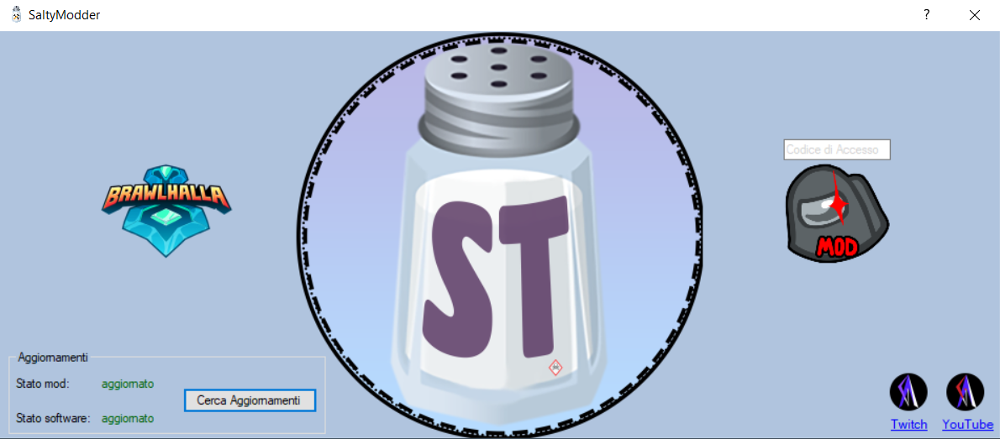
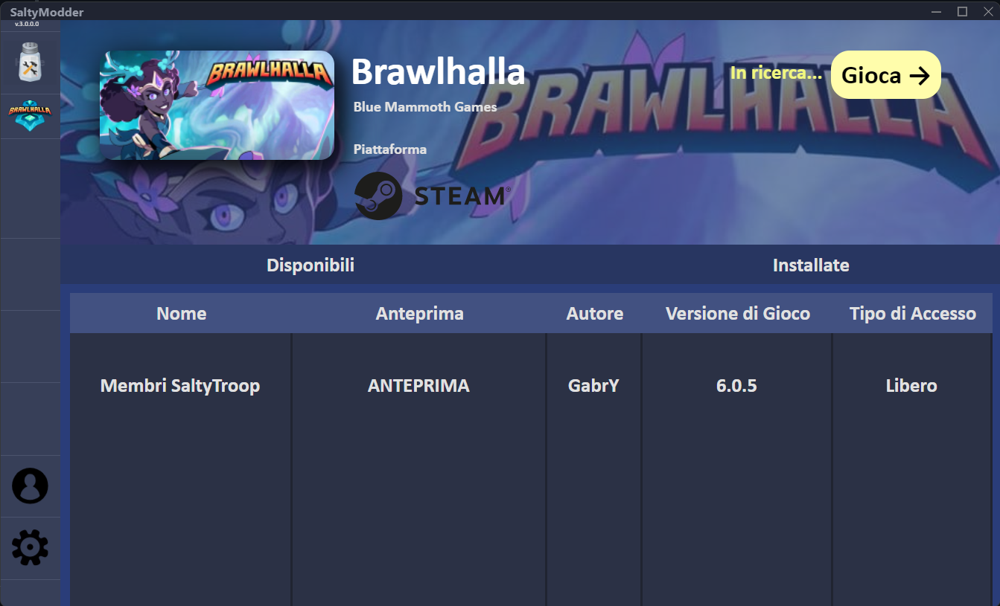

# SaltyModder (sospeso)
  

### Avviso
>Quando avrò voglia (e tempo soprattutto) cercherò di continuare lo sviluppo e rilasciare alcune mod.
Questa repository verrà molto probabilmente cancellata in futuro visto che il softaware non sarà open source (per cui github non avrebbe senso utilizzarlo) ed ospitato su un sito esterno.
Verrà migliorata l'interfaccia e il software riscritto totalmente da zero utlizzando un nuovo framework, sempre se ne varrà la pena, il tempo e se mi vengono in mente idee malate di modding.

#### ver.2.0.0
>

#### Sneak Peek grafico ver.3.0.0 (in-dev.)
>
